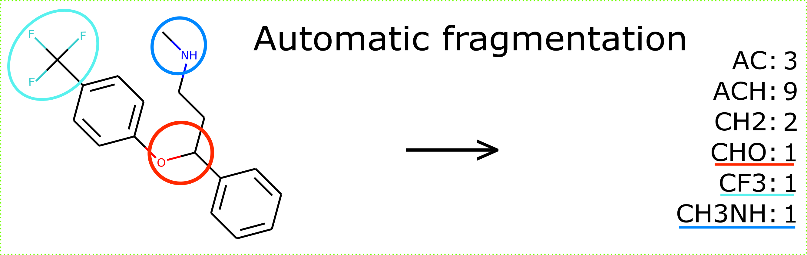

# fragmentation_algorithm (new version)

- This algorithm allows fragmenting molecules in an automatic manner based on groups defined as SMARTS.
- You can execute fragmenter.py and this will show a small example of what the algorithm can do.
- Why is there a newer version?
  - The fragmentation algorithm originally published with [the paper](https://doi.org/10.1186/s13321-019-0382-3) tried to find smaller functional groups that are contained within other larger functional groups to sort them automatically in an intelligent way. This turned out to be quite difficult to implement as the capabilities of RDKit to match SMARTS with SMARTS are  limited. This lead me to writing workarounds that became broken in subsequent RDKit versions.
  - The newer version does not try to automatically sort the groups you are searching for in an automatic way but relies on the user to provide this order. This allows the algorithm to be applicable with recent RDKit versions without problems.

---
The [original version of this algorithm](https://github.com/simonmb/fragmentation_algorithm_paper) was published with a paper applying it for UNIFAC:
- Title: **Flexible Heuristic Algorithm for Automatic Molecule Fragmentation: Application to the UNIFAC Group Contribution Model**
- DOI: [10.1186/s13321-019-0382-39](https://doi.org/10.1186/s13321-019-0382-3)
